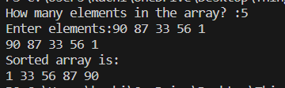

# Bubble Sort

## Theory
Bubble Sort Algorithm is the simplest sorting algorithm that works by repeatedly swapping the adjacent elements if they are in the wrong order. This algorithm is not suitable for large data sets as its average and worst-case time complexity is quite high.
### How it works
It compares the adjecent pairs and swaps the two if they are in the wrong order. After the First Iteration, the last value is guarenteed to be the right place so the next iteration goes till N-1th place.
Therefore the loop take (N(N-1))/2 comparisons to complete its sorting. (N=number of elements).
  The diagrammatic representation of bubble sort is:
 

## Algorithm
Step 1 − Check if the first element in the input array is greater than the next element in the array.
 
Step 2 − If it is greater, swap the two elements; otherwise move the pointer forward in the array.
 
Step 3 − Repeat Step 2 until we reach the end of the array.
 
Step 4 − Check if the elements are sorted; if not, repeat the same process (Steps 1 through 3) from the last element of the array to the first.
 
Step 5 − The final output achieved is the sorted array.
## Explaination
We approach the code by using 2 loops. The outside loop is a while loop which runs *(however many elements are there)* n number of times.
In the inside loop is a for loop which runs from 0 to n *(number of elements)*, and we compare the elemenmts of the array of indices i and i+1, if they are in the incorrect order, we swap them.
## Output

